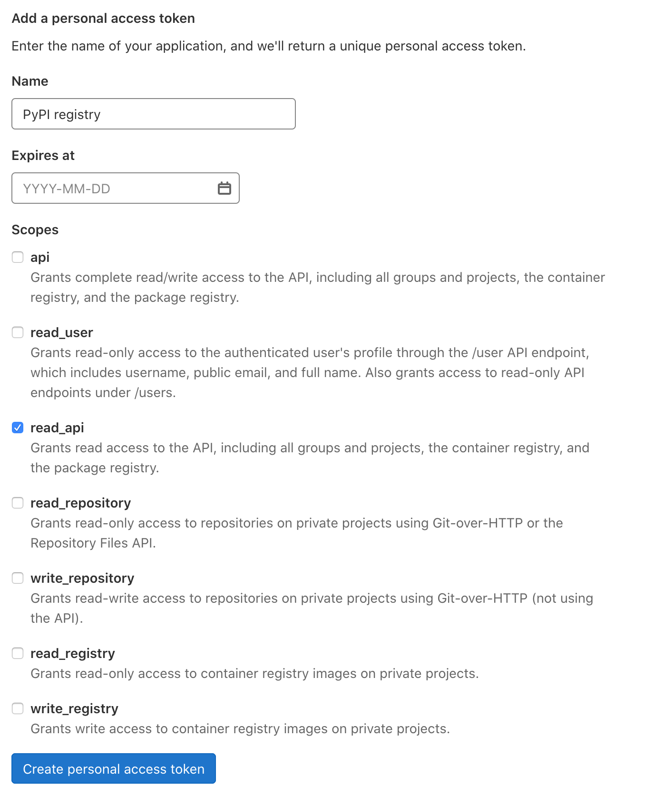
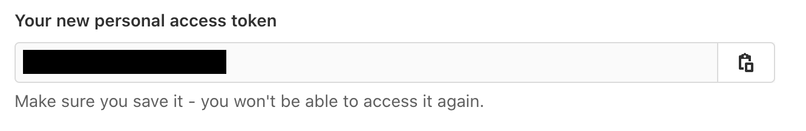

# Install

```{attention}
This documentation is outdated. It relies on the GITZ server, where we used to host our project at.
```

Currently, LaTeXBuddy is distributed via a PyPI-compatible package registry hosted by GITZ. This adds extra steps to the installation, but we'll guide you through it!

### Create a token

To install packages from GITZ's GitLab Package Registry you'll need to create a personal token. Go to https://git.rz.tu-bs.de/-/profile/personal_access_tokens and create a personal token with the `read_api` scope. You can give it any name and expiration date you want.



After clicking "Create personal access token", you'll be shown your created token. **This is the only time you'll see it**, so make sure to copy it to not lose it!



### Enable VPN

Access to most parts of the GITZ infrastructure is closed for people not affiliated with the university. For good measure, [enable your VPN](https://doku.rz.tu-bs.de/doku.php?id=netz:vpn:vpn_einrichten).

### Install the package

To install the package, execute the following command:

```sh
pip install latexbuddy --extra-index-url https://__token__:<your_personal_token>@git.rz.tu-bs.de/api/v4/projects/585/packages/pypi/simple
```

Don't forget to replace `<your_personal_token>` with the token, generated in the previous step!

### Other versions

To install other versions and to view the generic information about the package, you can navigate to [its page in GitLab](https://git.rz.tu-bs.de/sw-technik-fahrzeuginformatik/sep/sep-2021/ibr_alg_0/latexbuddy/-/packages/8).
